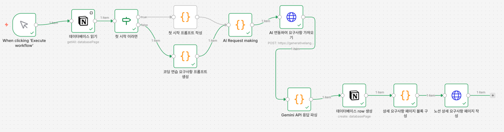

# 일일 코딩 연습
하루마다 요구사항을 자동으로 생성하여 1시간 동안 코딩 연습을 하기 위한 프로젝트
## 코딩 연습 요구사항
- **반드시 이전 기능들과 자연스럽게 연결되는 확장 기능**
- 1시간 내 구현 가능 
  - 1시간이 넘어가면 바로 종료
- 테스트 작성 가능
## 요구사항 자동 생성 workflow
- ai를 이용하여 요구사항 생성
- 노션 API를 이용하여 데이터베이스 row 생성 및 페이지 내용 작성


## 도메인 종류
- 결제: 결제/환불/정산 관련
- 주문: 주문/배송/재고 관련
- 쿠폰: 쿠폰/할인/프로모션 관련
- 추천: 추천/개인화/검색 관련
- 통계: 통계/리포트/대시보드 관련
- 알림: 알림/메시지/푸시 관련

## 난이도
```javascript
const difficultyGuide = {
  1: "매우 단순 - 단일 조건, 직선적인 흐름 (예: 데이터 조회 후 그대로 반환)",
  2: "단순 - 2-3개 조건 분기, 기본 유효성 검사 (예: 필수 필드 체크)",
  3: "보통-하 - 여러 조건 조합, 간단한 상태 관리 (예: 상태에 따른 다른 처리)",
  4: "보통 - 다중 엔티티 간 관계, 기본 비즈니스 규칙 (예: 권한에 따른 필터링)",
  5: "보통-상 - 복잡한 유효성 검증, 여러 단계의 처리 로직 (예: 주문 생성 시 재고 확인)",
  6: "복잡 - 여러 엔티티 간 복잡한 상호작용 (예: 결제 + 포인트 + 쿠폰 동시 처리)",
  7: "매우 복잡 - 트랜잭션 관리, 보상 처리 로직 (예: 예약 시스템의 충돌 방지)",
  8: "고급 - 복잡한 비즈니스 규칙 조합, 다단계 상태 머신 (예: 승인 워크플로우)",
  9: "전문가 - 여러 도메인의 복잡한 규칙 조율 (예: 동적 가격 책정 엔진)",
  10: "아키텍트 - 복잡한 도메인 로직 설계 필요 (예: 멀티테넌시 격리 정책)"
};
```